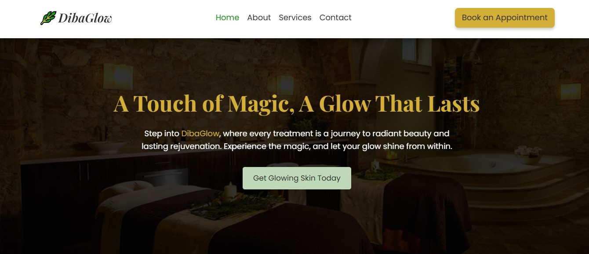
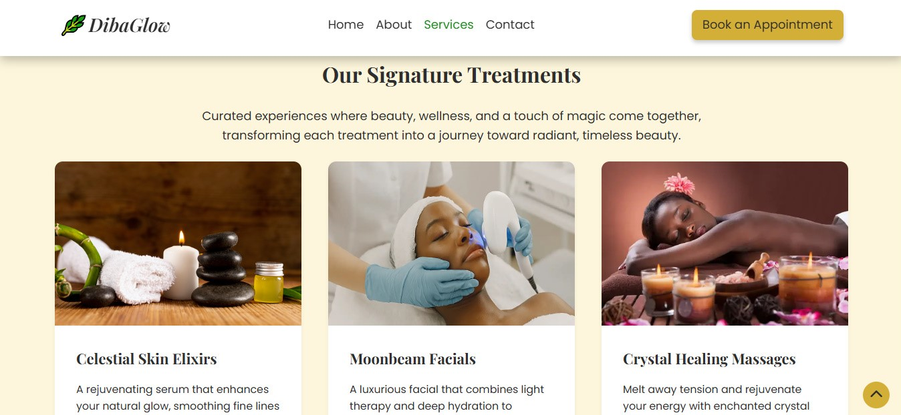

# DibaGlow - Medical Spa Website

DibaGlow is a modern, responsive website for a fictional medical spa brand. Built with HTML, CSS, and JavaScript, it highlights clear service listing, builds trust with testimonials, answers client questions through a clear FAQ, and encourages conversions via an accessible contact form. It was created to demonstrate my ability to bring a wellness brand identity to life through thoughtful design and clean development practices.

## 🌐 Live Demo:

[View the live site](https://dibaglow.vercel.app/)

## 📸 Screenshots:

### DibaGlow website hero

### DibaGlow website services section

## Features:

**Modern, Elegant Design:** The site uses soft visuals, neutral tones, and calming animations to align with the brand's wellness and luxury identity.

**Service Cards:** Each spa service is displayed in a well-structured and visually appealing card format, with detailed information.

**FAQ Section:** An accordion-style FAQ section to answer common client questions.

**Contact Form:** A user-friendly contact form for inquiries and appointments.

**Fully Responsive Design:** Ensures a seamless experience across all devices/screen sizes.

**Testimonials Section:** Showcasing positive client feedback.

Pricing section with clear service breakdown.

Newsletter subscription section for client engagement.

## Technologies Used:

**HTML5:** For structuring the website content.

**CSS3:** Custom stylesheets for layout, colors, and visual elements.

**JavaScript:** For adding interactivity such as FAQ interaction, dynamic content, and essential logic.

## Author:

- Portfolio: [chijioke-nwabasili.vercel.app](https://chijioke-nwabasili.vercel.app)
- LinkedIn: [Chijioke Nwabasili](https://linkedin.com/in/chijioke-nwabasili)
